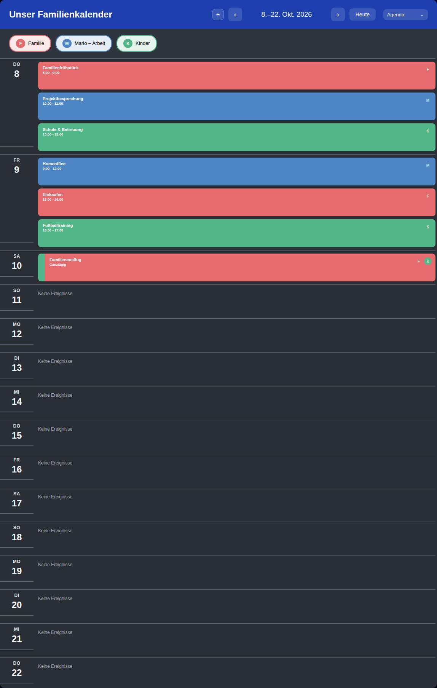
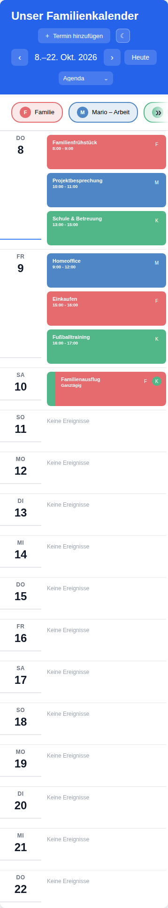

# Family Calendar Card for Home Assistant

[](https://github.com/hacs/integration)
[](https://github.com/Baeka89)
[](https://paypal.me/misomazo)
[](LICENSE)

[Deutsch](#deutsch) | [English](#english) · [Changelog](CHANGELOG.md)

---

<a id="deutsch"></a>

## Deutsch 🇩🇪

### Über dieses Projekt

**Family Calendar Card** bringt mehrere Home-Assistant-Kalender in einer gemeinsamen Dashboard-Karte zusammen. Termine, Familienmitglieder und Wetter lassen sich übersichtlich darstellen und individuell gestalten.

Das Projekt wird von **Baeka89** entwickelt und gepflegt. Die Karte lässt sich über den visuellen Editor oder YAML konfigurieren.

**Versionen:** Veröffentlichte Versionen findest du unter [Releases](https://github.com/Baeka89/family-calendar-card/releases). Änderungen sind im [Changelog](CHANGELOG.md) dokumentiert.

### Features

- **Vier Ansichten:** Monat, Woche, Schedule und Agenda.
- **Mehrere Kalender:** gemeinsame Darstellung, Kalenderfarben und zusammengeführte Termine.
- **Optionale Zusatzfunktion mit Begleitintegration – zusätzliche Zuordnung:** In den Termindetails unter „Betrifft auch diese Kalender“ weitere konfigurierte Kalender auswählen. Auch bei schreibgeschützten Einladungen werden deren Namen und Farben angezeigt. Die Zuordnung wird mit der Begleitintegration für alle Geräte und Benutzer dieser Home-Assistant-Instanz gespeichert und ändert den Originaltermin nicht; bei Serien gilt sie nur für das ausgewählte Vorkommen.
- **Terminverwaltung:** Termine erstellen und bearbeiten, einschließlich Wiederholungen; verfügbare Aktionen hängen von der Kalenderintegration und ihren Schreibrechten ab.
- **Wetter:** Vorhersagen aus einer Home-Assistant-Wetterentität.
- **Individuelle Darstellung:** Termin- und Tagesstile, Tages-Badges und virtuelle Kalender.
- **Familienmitglieder:** Einbindung von `person`-Entitäten.
- **Beschreibungen:** Markdown- und HTML-Darstellung für Termindetails.
- **Bedienung:** visueller Konfigurationseditor und responsive Ansichten für Tablets und andere Bildschirmgrößen.

### Voraussetzungen

- Home Assistant mit mindestens einer `calendar`-Entität.
- Optional eine `weather`-Entität für Vorhersagen und `person`-Entitäten für Familienmitglieder.
- Eine schreibfähige Kalenderintegration, wenn Termine über die Karte verwaltet werden sollen.

### Unterstützung

Fehler und Vorschläge kannst du über die [GitHub Issues](https://github.com/Baeka89/family-calendar-card/issues) melden. Bitte ergänze Kartenversion, Home-Assistant-Version, verwendete Kalenderintegration und Schritte zum Nachstellen; entferne persönliche Termindaten aus Beispielen.

Wenn du die Weiterentwicklung unterstützen möchtest: **[Spende via PayPal](https://paypal.me/misomazo)**.

---

<a id="english"></a>

## English 🇺🇸

### About this Project

**Family Calendar Card** brings multiple Home Assistant calendars together in one dashboard card. Customize how events, family members and weather forecasts appear.

The project is developed and maintained by **Baeka89**. Configure the card using the visual editor or YAML.

**Versions:** Published versions are available under [Releases](https://github.com/Baeka89/family-calendar-card/releases). Changes are documented in the [changelog](CHANGELOG.md).

### Features

- **Four views:** Month, Week, Schedule and Agenda.
- **Multiple calendars:** shared views, calendar colors and combined events.
- **Optional companion feature – additional assignments:** Open event details and select additional configured calendars under “Also concerns these calendars”. Their names and colors appear even for read-only invitations. Assignments are shared across this Home Assistant instance using the companion integration without changing the original event; recurring assignments apply only to the selected occurrence.
- **Event management:** create and edit events, including recurring events; available actions depend on the calendar integration and its write permissions.
- **Weather:** forecasts from a Home Assistant weather entity.
- **Customization:** event styles, day styles, day badges and virtual calendars.
- **Family members:** support for `person` entities.
- **Descriptions:** Markdown and HTML rendering in event details.
- **Controls:** visual configuration editor and responsive views for tablets and other screen sizes.

### Requirements

- Home Assistant with at least one `calendar` entity.
- Optional `weather` and `person` entities for forecasts and family members.
- A calendar integration with write support to manage events through the card.

### Support

Report bugs and suggestions through [GitHub Issues](https://github.com/Baeka89/family-calendar-card/issues). Include the card version, Home Assistant version, calendar integration and reproduction steps. Remove personal event data from examples.

To support development: **[Donate via PayPal](https://paypal.me/misomazo)**.

---

## Gallery / Galerie

**[Browse all 48 screenshots and example configurations / Alle 48 Screenshots und Beispielkonfigurationen ansehen](docs/images/gallery/README.md)**

The complete collection is included in the repository. Download `docs/images/gallery` to use its interactive `index.html` locally. / Die vollständige Sammlung liegt im Repository. Den Ordner `docs/images/gallery` herunterladen, um die interaktive `index.html` lokal zu verwenden.


Die folgenden neun Bilder wurden aus der Design-Auswahl ausgewählt und zeigen Beispieltermine. Sie stammen aus einem früheren Projektstand; einzelne Beschriftungen und Details können von der aktuellen Version abweichen. Die beschriebenen Funktionen beziehen sich auf die aktuelle Karte.

These nine images were selected from the design gallery and show example events. They were captured from an earlier project version; individual labels and details may differ from the current version. The descriptions refer to the current card.

### Month overview / Monatsübersicht

**Deutsch:** Die helle Monatsansicht zeigt Termine aus Familie, Arbeit und Kinderkalender gemeinsam. Kalenderfarben kennzeichnen die Herkunft; Navigation und Ansichtsauswahl befinden sich im Kopfbereich.

**English:** The light month view brings family, work and children’s calendars together. Calendar colors identify the source; navigation and view selection sit in the header.


### Week view in dark mode / Wochenansicht im Dunkelmodus

**Deutsch:** Eine Woche als Tagesspalten mit Uhrzeiten und Ganztagsterminen. Farbige Seitenleisten unterscheiden die Kalender bei neutralem Terminhintergrund; alternativ sind vollflächige oder getönte Terminfarben möglich.

**English:** A week arranged in day columns with event times and all-day entries. Colored sidebars distinguish calendars against neutral backgrounds; solid and tinted event backgrounds are also available.


### Schedule with time grid / Zeitplan mit Stundenraster

**Deutsch:** Termine stehen entsprechend Beginn und Dauer im Stundenraster. Ganztagstermine erscheinen oberhalb des Rasters. Der angezeigte Stundenbereich lässt sich konfigurieren.

**English:** Events occupy the time grid according to their start and duration. All-day events appear above the grid. The displayed hour range is configurable.


### Agenda in dark mode / Agenda im Dunkelmodus

**Deutsch:** Die Agenda listet Termine nach Tagen mit Uhrzeit und Kalenderkürzel. Farben und Kalenderkennzeichen machen die Zuordnung sichtbar. Die Textausrichtung lässt sich im Editor auf automatisch, links, mittig oder rechts einstellen.

**English:** The agenda groups events by day, showing their times and calendar initials. Colors and calendar markers identify the participants. Text alignment can be set to automatic, left, center or right in the editor.



### Individual calendar palettes / Individuelle Kalenderfarben

**Deutsch:** Eine alternative Farbpalette mit Violett, Blau und Orange. Die Farben werden pro Kalender eingestellt und erscheinen in den Kalender-Schaltflächen sowie an den Terminen.

**English:** An alternative palette of purple, blue and orange. Colors are configured per calendar and appear in calendar buttons and events.


### Create an event / Termin erstellen

**Deutsch:** Der Erstellungsdialog bietet die Kalenderauswahl, Titel, Beginn, Ende, Ort und Beschreibung. Ganztags- und Wiederholungsoptionen stehen ebenfalls bereit. Das Speichern benötigt einen Kalender, dessen Home-Assistant-Integration die Erstellung unterstützt.

**English:** The creation dialog offers calendar selection, title, start, end, location and description, plus all-day and recurrence options. Saving requires a calendar whose Home Assistant integration supports event creation.


### Custom event color / Eigene Terminfarbe

**Deutsch:** Für einen bestehenden Termin lässt sich eine eigene Farbe über Farbauswahl, Helligkeit, Hex-Wert oder Farbfelder wählen und auf den Standard zurücksetzen. Diese Farbänderung betrifft die Anzeige der Karte und wird lokal im Browser gespeichert; der Originaltermin bleibt unverändert.

**English:** For an existing event, choose a custom color using the color picker, brightness, hex value or swatches, or restore the default. This changes the card’s appearance and is stored locally in the browser; the source event remains unchanged.


### Visual color settings / Visuelle Farbeinstellungen

**Deutsch:** Im Editor lassen sich Kopfbereich, Kopftext, Raster- und Trennlinien sowie Kalender- und Terminschriftfarben einstellen. Weitere Bereiche bieten Kalendernamen, Badge-Symbole und Personenzuordnungen. Transparenz und Farbschema sind ebenfalls auswählbar.

**English:** The editor exposes header, header text, grid and separator colors, plus calendar and event text colors. Additional sections offer calendar names, badge icons and person mappings. Transparency and color scheme can also be selected.


### Mobile agenda / Mobile Agenda

**Deutsch:** Die Agenda auf einem schmalen Bildschirm: Kopfbereich und Bedienelemente passen sich an die verfügbare Breite an. Termine bleiben nach Tagen geordnet; Kalenderfarben und Kürzel kennzeichnen die beteiligten Kalender.

**English:** The agenda on a narrow screen: the header and controls adapt to the available width. Events remain grouped by day, with calendar colors and initials identifying the calendars involved.



---

## How to Install / Installation

### HACS

**Deutsch:**

1. HACS öffnen und nach **Family Calendar Card** suchen.
2. Falls die Karte nicht gefunden wird: im Menü **benutzerdefinierte Repositories** die Adresse `https://github.com/Baeka89/family-calendar-card` hinzufügen; als Typ **Dashboard** wählen (in älteren HACS-Versionen „Frontend“).
3. **Family Calendar Card** herunterladen.
4. Unter den Dashboard-Ressourcen prüfen, ob `/hacsfiles/family-calendar-card/family-calendar-card.js` als **JavaScript-Modul** eingetragen ist; bei Bedarf ergänzen.
5. Browser neu laden und die Karte zum Dashboard hinzufügen.

**English:**

1. Open HACS and search for **Family Calendar Card**.
2. If the card is not listed, add `https://github.com/Baeka89/family-calendar-card` under **Custom repositories**, with type **Dashboard** (called “Frontend” in older HACS versions).
3. Download **Family Calendar Card**.
4. Check dashboard resources for `/hacsfiles/family-calendar-card/family-calendar-card.js`, configured as a **JavaScript module**; add it if needed.
5. Reload your browser and add the card to your dashboard.

### Manual / Manuell

| Schritt / Step | Deutsch | English |
| --- | --- | --- |
| 1 | Die fertige [family-calendar-card.js](family-calendar-card.js) aus diesem Paket oder Repository verwenden. | Use the built [family-calendar-card.js](family-calendar-card.js) from this package or repository. |
| 2 | Nach `<config>/www/family-calendar-card.js` kopieren. | Copy it to `<config>/www/family-calendar-card.js`. |
| 3 | `/local/family-calendar-card.js?v=1` als Dashboard-Ressource vom Typ **JavaScript-Modul** hinzufügen. | Add `/local/family-calendar-card.js?v=1` as a dashboard resource of type **JavaScript module**. |
| 4 | Browser neu laden. Nach Updates den Wert von `?v=` erhöhen, falls der Browser die alte Datei lädt. | Reload the browser. After updates, increase `?v=` if the browser loads the old file. |

---

## Quick Start / Schnellstart

Eine manuelle Dashboard-Karte hinzufügen und die Beispiel-Entitäten durch eigene ersetzen. / Add a manual dashboard card and replace the sample entities with your own.

```yaml
type: custom:family-calendar-card
title: Family Calendar
entities:
  - calendar.family
  - calendar.work
  - calendar.holidays
```

Weitere Einstellungen sind im visuellen Editor verfügbar. / More settings are available in the visual editor.

---

## Documentation / Dokumentation

Die ausführliche Dokumentation liegt im Repository unter [`docs/`](docs). Die Seiten sind als englische MDX-Quelldateien verfügbar; eine separate Dokumentationswebsite ist nicht eingerichtet. / Detailed documentation is available as English MDX source files in [`docs/`](docs); there is no separately hosted documentation site.

- [Basic configuration / Grundkonfiguration](docs/configuration/basic.mdx)
- [Display options / Anzeigeoptionen](docs/configuration/display.mdx)
- [Appearance / Gestaltung](docs/configuration/appearance.mdx)
- [Weather / Wetter](docs/configuration/weather.mdx)
- [Event management / Terminverwaltung](docs/configuration/event-management.mdx)
- [Event styles / Terminstile](docs/advanced/event-styles.mdx)
- [Day styles / Tagesstile](docs/advanced/day-styles.mdx)
- [Day badges / Tages-Badges](docs/advanced/day-badges.mdx)
- [Virtual calendars / Virtuelle Kalender](docs/advanced/virtual-calendars.mdx)
- [Troubleshooting / Fehlerbehebung](docs/troubleshooting.mdx)

---

## Technical Components / Technische Komponenten

| Datei / File | Aufgabe / Purpose |
| --- | --- |
| `src/family-calendar-card.js` | Hauptkomponente und Build-Einstieg / Main component and build entry point. |
| `src/events/` | Termindaten, Formulare und Kalender-Aufrufe / Event data, forms and calendar requests. |
| `src/renderers/`, `src/views/` | Darstellung und Ansichtsmodelle / Rendering and view models. |
| `src/editor/` | Visueller Konfigurationseditor / Visual configuration editor. |
| `src/weather/` | Wetterdaten und Aktualisierung / Weather data and refresh logic. |
| `src/translations.js` | Übersetzungen der Karte / Card translations. |
| `family-calendar-card.js` | Generierte Datei für HACS und manuelle Installation / Built file for HACS and manual installation. |
| `hacs.json` | HACS-Metadaten / HACS metadata. |

Entwicklung und Prüfung: [DEVELOPMENT.md](DEVELOPMENT.md). Änderungen: [CHANGELOG.md](CHANGELOG.md). / Development and validation: [DEVELOPMENT.md](DEVELOPMENT.md). Release notes: [CHANGELOG.md](CHANGELOG.md).

### Thanks / Danke

Danke an die Home-Assistant-Community für Feedback, Ideen und Tests. / Thanks to the Home Assistant community for feedback, ideas and testing.

Family Calendar Card wird von **[Baeka89](https://github.com/Baeka89)** gepflegt. Lizenz: [MIT](LICENSE). / Family Calendar Card is maintained by **[Baeka89](https://github.com/Baeka89)**. License: [MIT](LICENSE).

### Gemeinsame Kalenderzuordnung / Shared calendar assignments

**Die Karte funktioniert eigenständig. Die Begleitintegration ist optional** und wird nur für geräteübergreifende zusätzliche Kalenderzuordnungen benötigt. Kalenderanzeige, Ansichten, Farben und die vom Quellkalender unterstützte Terminbearbeitung benötigen sie nicht.

Für gemeinsame Zuordnungen die separate Integration **Family Calendar Card Companion** installieren (Repository `Baeka89/family-calendar-card-companion`). Solange sie nicht im HACS-Standardkatalog aufgenommen ist, dieses Repository in HACS als benutzerdefiniertes Repository vom Typ **Integration** hinzufügen. Danach herunterladen, Home Assistant neu starten und unter **Einstellungen → Geräte & Dienste → Integration hinzufügen → Family Calendar Card Companion** einrichten. Für neue Installationen ist kein YAML-Eintrag nötig.

Bestehende manuelle Installationen können den aktualisierten Ordner `custom_components/family_calendar_card` weiterhin verwenden. Ein vorhandener `family_calendar_card:`-YAML-Eintrag wird automatisch in einen UI-Eintrag übernommen; nach erfolgreicher Übernahme kann er entfernt werden. Der Speicherpfad bleibt gleich und gemeinsame Zuordnungen bleiben erhalten.

Ohne aktive Integration zeigt die zusätzliche Zuordnung im Termin einen Hinweis. Mit Integration können alle authentifizierten Home-Assistant-Benutzer diese gemeinsamen Zuordnungen bearbeiten. Originaltermine bleiben unverändert. Speichern verändert nur Zuordnungen zu den in dieser Karte konfigurierten Kalendern. Kalenderfarben und ausgeblendete Kalender bleiben lokale Einstellungen. Alte rein lokale Zuordnungen werden nicht automatisch hochgeladen.

**The card works independently. The companion is optional**, needed only for shared additional calendar assignments. Install the separate Family Calendar Card Companion integration through HACS (custom integration repository until accepted into the default catalog), restart Home Assistant and add it under **Settings → Devices & services → Add integration**. No YAML is needed for new installations. Existing YAML installations are imported automatically and retain their shared storage. The dashboard-card download does not install the companion. Source events stay unchanged; authenticated users can change shared assignments. Colors and visibility preferences remain local.

Agenda-Textausrichtung / Agenda text alignment: `agenda_text_alignment: left` (auch `center` und `right`). Im Karteneditor unter **Anzeige und Layout** einstellen.

### Languages / Sprachen

Card, visual editor and companion setup support English, German, French, Dutch, Spanish, Estonian, Catalan, Danish and Swedish. README and changelog are maintained in English and German. Home Assistant’s selected language is used where supported; other languages fall back to English.

Karte, visueller Editor und Einrichtung der Begleitintegration unterstützen Englisch, Deutsch, Französisch, Niederländisch, Spanisch, Estnisch, Katalanisch, Dänisch und Schwedisch. README und Changelog werden auf Englisch und Deutsch gepflegt. Die gewählte Home-Assistant-Sprache wird verwendet, sofern unterstützt; andere Sprachen verwenden Englisch.

### Agenda content height / Agenda-Inhaltshöhe

**English:** Set `compact_height: false` to size Agenda to its visible content. Use `hide_empty_days: true` to omit dates without visible events. `rolling_days_agenda: 2` means today plus two additional days (three dates in total). Remove any explicit height allocation in the dashboard layout if space is still reserved outside the card. `compact_height: true` intentionally fills a fixed-height layout or the available viewport.

**Deutsch:** Mit `compact_height: false` richtet sich die Agenda-Höhe nach dem sichtbaren Inhalt. `hide_empty_days: true` lässt Tage ohne sichtbare Termine weg. `rolling_days_agenda: 2` bedeutet heute plus zwei weitere Tage (insgesamt drei Tage). Falls außerhalb der Karte weiterhin Platz reserviert ist, die feste Höhenvorgabe im Dashboard-Layout entfernen. `compact_height: true` füllt bewusst ein Layout mit fester Höhe oder die verfügbare Bildschirmhöhe.

**Hidden calendar badges / Ausgeblendete Kalender-Badges:** `hide_badge_calendars` hides the selected calendars’ badges in every view and event details, including calendar name prefixes. Events and colors remain visible. / `hide_badge_calendars` blendet die Badges der ausgewählten Kalender in allen Ansichten und Termindetails aus, einschließlich Kalendernamen vor dem Titel. Termine und Farben bleiben sichtbar.
